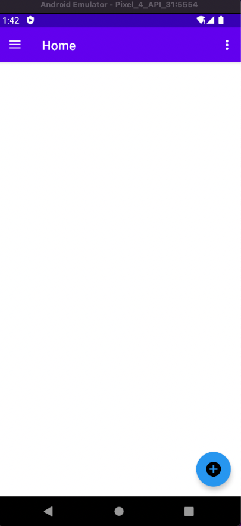
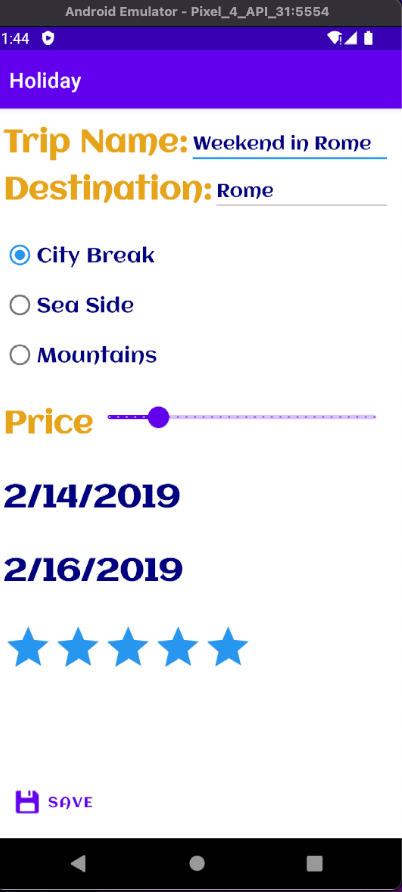
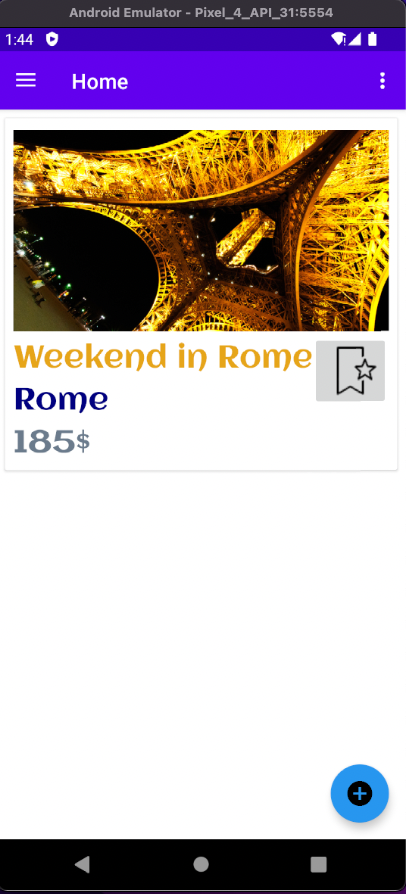
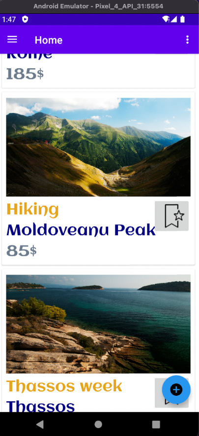
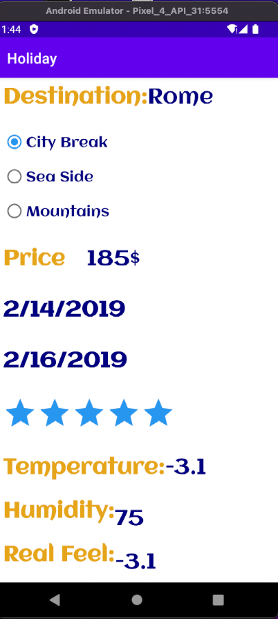
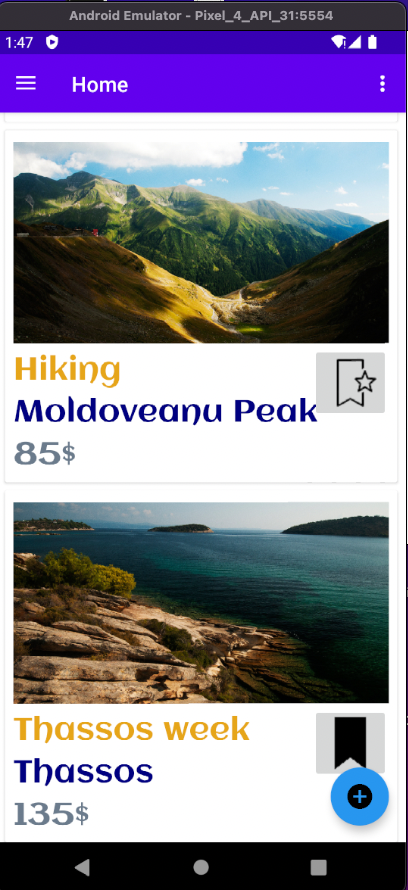
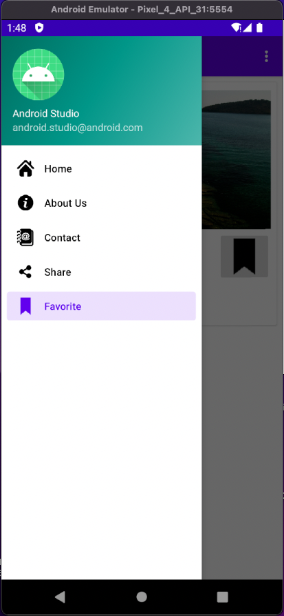
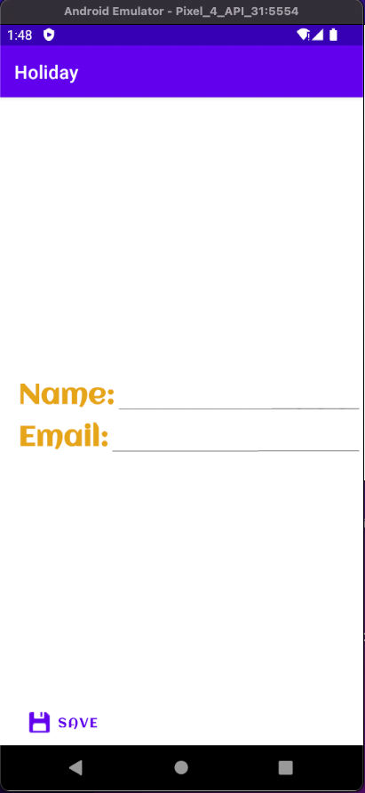
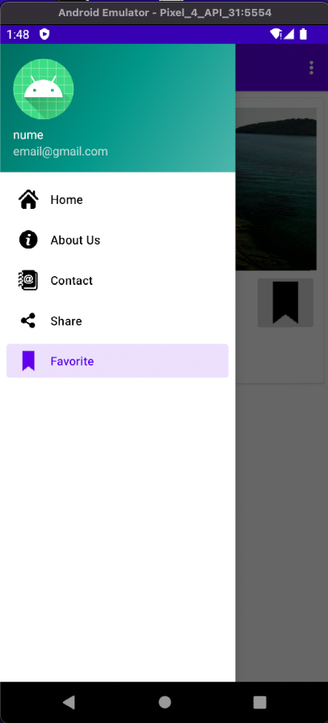
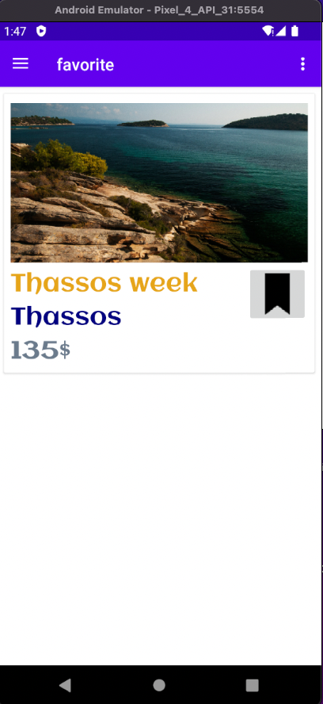

Mobile application where you can store your trips.
Built an android app using java that  keeps track of user's past holidays.The user can add a new trip completing a form that contains  details about the trip such as the start date, the end date, budget, rating, trip category(Mountain ,City Break or Seaside).On the main page of the app, all the trips are displayed and there is the possibility of adding trips to the bookmark list.All the trips are saved in a Room database.

Demo

This is how it looks when you first open the app:

If the user click on the fab, it opens the add a trip page:

This is the main page after a trip has been added

Next, I added 2 more trips

The images in the trip card are shown based on the trip category.

If the user press on a trip, detailes of the trip will be shown with the addition of real time weather.

User can add certain trips to a favorite trips list

This is the navigation drawer

If the user press on the three dots, he can change the username and email

This is the favorite trips list

